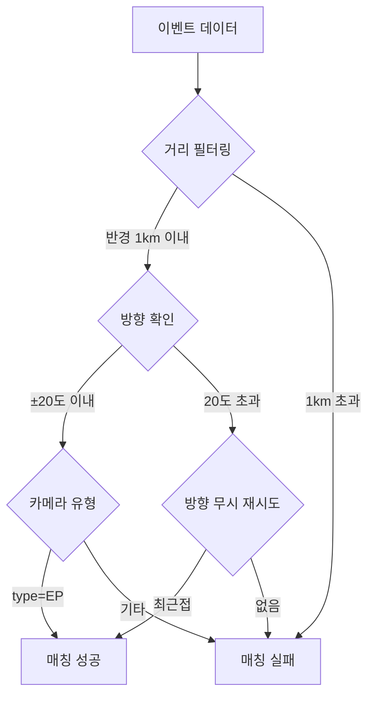

검색된 코드베이스 "수정된 코드로 다시 작성", 3 결과

# CSV to Excel Events Converter

이벤트 데이터가 포함된 CSV 파일을 읽어 속도 카메라 정보와 매칭하여 Excel 파일로 변환하는 Python 스크립트입니다.

## 📋 목차

- 주요 기능
- 시스템 요구사항
- 설치
- 사용 방법
- 입력 파일 형식
- 출력 형식
- 카메라 매칭 알고리즘
- 설정 상수
- 문제 해결

## 주요 기능

### 🎯 핵심 기능
- **이벤트 데이터 집계**: 특정 이벤트 코드(81-85) 필터링 및 시간순 정렬
- **속도 카메라 매칭**: GPS 좌표와 진행 방향 기반 고정밀 매칭
- **과속 분류**: 제한 속도 대비 실제 속도 자동 분석 (4단계)
- **월별 시트 분리**: Excel 파일을 월별로 자동 구성
- **배치 처리**: 디렉터리 내 모든 CSV 파일 일괄 변환

### 📊 데이터 처리
- `(_source_file, Num_event)` 기준 그룹화
- 각 이벤트별 시간순 3개 레코드 추출 (t0, t+5s, t+10s)
- 카메라 정보 자동 조인 및 제한 속도 매핑
- 과속 여부 자동 판정

## 시스템 요구사항

### 필수 라이브러리
```bash
pip install pandas openpyxl
```

| 라이브러리 | 버전 | 용도 |
|----------|------|------|
| pandas | ≥1.3.0 | CSV/Excel 데이터 처리 |
| openpyxl | ≥3.0.0 | Excel 파일 생성 |

### 선택 사항 (SpatiaLite)
SQLite DB에서 공간 데이터를 사용하는 경우 필요:

**Windows**
```bash
# mod_spatialite.dll 필요
# 다운로드: http://www.gaia-gis.it/gaia-sins/
```

**Linux**
```bash
sudo apt-get install libspatialite-dev
# 또는
sudo yum install libspatialite-devel
```

**macOS**
```bash
brew install libspatialite
```

## 설치

### 1. 프로젝트 구조 설정
```
프로젝트_폴더/
├── csv_to_excel_events.py    # 메인 스크립트
├── SQLite/
│   └── 20250602.sqlite        # 기본 카메라 DB (선택)
├── input_table.csv            # 기본 카메라 CSV (선택)
├── BTO_output/                # 기본 출력 폴더 (자동 생성)
└── 입력_데이터/
    ├── event_data1.csv
    └── event_data2.csv
```

### 2. 라이브러리 설치
```bash
pip install -r requirements.txt
```

### 3. SpatiaLite 설정 (선택)

#### 환경 변수 방식
```bash
# Windows (CMD)
set SPATIALITE_LIBRARY_PATH=C:\path\to\mod_spatialite.dll

# Windows (PowerShell)
$env:SPATIALITE_LIBRARY_PATH="C:\path\to\mod_spatialite.dll"

# Linux/Mac
export SPATIALITE_LIBRARY_PATH=/usr/lib/x86_64-linux-gnu/mod_spatialite.so
```

#### 명령행 옵션 방식
```bash
python csv_to_excel_events.py --input data.csv --spatialite /path/to/mod_spatialite.dll
```

## 사용 방법

### 기본 사용법

#### 1️⃣ 단일 파일 변환
```bash
python csv_to_excel_events.py --input event_data.csv
```
출력: `./BTO_output/event_data_output.xlsx`

#### 2️⃣ 디렉터리 일괄 변환
```bash
python csv_to_excel_events.py --input-dir ./csv_folder
```
출력: `./BTO_output/csv_folder_output/`

### 고급 사용법

#### 📁 카메라 데이터 소스 지정

**SQLite DB 사용**
```bash
python csv_to_excel_events.py \
  --input data.csv \
  --cam-db ./SQLite/cameras.sqlite \
  --cam-table 250602
```

**CSV 파일 사용**
```bash
python csv_to_excel_events.py \
  --input data.csv \
  --cam-csv ./camera_info.csv
```

**자동 탐색 (권장)**
```bash
# 다음 순서로 자동 탐색:
# 1. ./SQLite/20250602.sqlite
# 2. ./input_table.csv
python csv_to_excel_events.py --input data.csv
```

#### 📂 출력 디렉터리 지정
```bash
python csv_to_excel_events.py \
  --input data.csv \
  --output-dir ./results/2025
```

#### 🔧 SpatiaLite 모듈 명시
```bash
python csv_to_excel_events.py \
  --input data.csv \
  --spatialite C:\sqlite\mod_spatialite.dll
```

### 명령행 옵션 전체 목록

| 옵션 | 단축 | 설명 | 필수 | 기본값 |
|------|------|------|------|--------|
| `--input` | `-i` | 단일 CSV 파일 경로 | ① | - |
| `--input-dir` | - | CSV 디렉터리 경로 | ① | - |
| `--output-dir` | `-o` | 출력 디렉터리 | ❌ | BTO_output |
| `--cam-db` | - | 카메라 SQLite DB 경로 | ② | 20250602.sqlite |
| `--cam-csv` | - | 카메라 CSV 파일 경로 | ② | input_table.csv |
| `--cam-table` | - | SQLite 테이블 이름 | ❌ | `250602` |
| `--spatialite` | - | SpatiaLite 확장 모듈 경로 | ❌ | 자동 탐색 |

> ① `--input` 또는 `--input-dir` 중 하나 필수  
> ② `--cam-db`와 `--cam-csv`는 동시 사용 불가 (자동 탐색 가능)

## 입력 파일 형식

### CSV 이벤트 파일

#### 필수 컬럼
```csv
Num_event,DateTime,eventcode,Speed,GPS_X,GPS_Y,GPS_Degree,_source_file
1,250101123045,81,95.5,127.123456,37.654321,135.2,data_0101.csv
2,250101123050,82,87.3,127.123789,37.654654,138.5,data_0101.csv
```

| 컬럼명 | 타입 | 설명 | 예시 |
|--------|------|------|------|
| `Num_event` | 정수 | 이벤트 고유 번호 | `1`, `2`, `3` |
| `DateTime` | 문자열 | 날짜시간 (YYMMDDHHmmss) | `250101123045` |
| `eventcode` | 정수 | 이벤트 코드 (81-85만 처리) | `81`, `82` |
| `Speed` | 실수 | 속도 (km/h) | `95.5` |
| `GPS_X` | 실수 | 경도 | `127.123456` |
| `GPS_Y` | 실수 | 위도 | `37.654321` |
| `GPS_Degree` | 실수 | 진행 방향 (0-360도) | `135.2` |
| `_source_file` | 문자열 | 원본 파일명 | `data_0101.csv` |

#### 지원 인코딩
- **CP949** (기본, 한국어 Windows)
- UTF-8 with BOM
- EUC-KR

자동으로 순서대로 시도하여 읽습니다.

### 카메라 정보 파일

#### SQLite DB 스키마

**테이블 구조** (예: `250602`)
```sql
CREATE TABLE "250602" (
    idx INTEGER PRIMARY KEY,
    cam_id TEXT NOT NULL,
    speed REAL,
    heading REAL,
    code TEXT,
    type TEXT,
    GEOMETRY BLOB  -- SpatiaLite Point
);
```

| 컬럼명 | 타입 | 설명 | 필수 |
|--------|------|------|------|
| `idx` / `ogc_fid` | INTEGER | 행 인덱스 | ⭕ |
| `cam_id` | TEXT | 카메라 ID | ⭕ |
| `speed` | REAL | 제한 속도 (km/h) | ⭕ |
| `heading` | REAL | 카메라 방향 (0-360도) | ⭕ |
| `code` | TEXT | 카메라 코드 | ⭕ |
| `type` | TEXT | 카메라 유형 (`EP`만 사용) | ⭕ |
| `GEOMETRY` | BLOB | SpatiaLite Point | ⭕ |

**허용되는 카메라 코드**
```python
"1-130", "1-0", "1-12", "1-13", "1-2", "1-9", "1-139",
"7-130", "7-0", "7-9", "7-139", "48-0"
```

#### CSV 파일 형식

**헤더 예시**
```csv
cam_id,longitude,latitude,heading,speed,type,code
CAM001,127.123456,37.654321,90.0,80,EP,1-130
CAM002,127.234567,37.765432,180.5,60,EP,1-0
```

| 컬럼명 (우선순위) | 타입 | 설명 |
|------------------|------|------|
| `cam_id` | 문자열 | 카메라 ID |
| `longitude` / `lon` / `GPS_X` | 실수 | 경도 |
| `latitude` / `lat` / `GPS_Y` | 실수 | 위도 |
| `heading` / `cam_heading` | 실수 | 카메라 방향 (0-360도) |
| `speed` / `limit_speed` | 실수 | 제한 속도 (km/h) |
| `type` | 문자열 | `EP` (단속 카메라) |
| `code` | 문자열 | 카메라 코드 |
| `row_idx` / `idx` | 정수 | 행 인덱스 (선택) |

> 💡 **Tip**: 컬럼명은 대소문자 구분 없이 자동 매칭됩니다.

## 출력 형식

### Excel 파일 구조

```
event_data_output.xlsx
├── 01월 (January 데이터)
├── 02월 (February 데이터)
├── 03월 (March 데이터)
├── ...
└── 기타 (월 파악 불가 데이터)
```

### 출력 컬럼 상세

| 컬럼명 | 타입 | 설명 | 예시 |
|--------|------|------|------|
| `Num_event` | 정수 | 이벤트 번호 | `1` |
| `DateTime` | 문자열 | 이벤트 발생 시간 | `250101123045` |
| `eventcode` | 정수 | 이벤트 코드 | `81` |
| `GPS_X` | 실수 | 경도 | `127.123456` |
| `GPS_Y` | 실수 | 위도 | `37.654321` |
| `GPS_Degree` | 실수 | 진행 방향 | `135.2` |
| `camera_id` | 문자열 | 매칭된 카메라 ID | `CAM001` |
| `row_idx` | 정수 | 카메라 DB 행 인덱스 | `123` |
| `과속속도` | 실수 | 해당 위치 제한 속도 | `80.0` |
| `t0` | 실수 | 이벤트 발생 시점 속도 | `95.5` |
| `t+5s` | 실수 | 5초 후 속도 | `92.3` |
| `t+10s` | 실수 | 10초 후 속도 | `88.7` |
| `t0_과속속도_분류` | 정수 | 과속 분류 코드 (0-3) | `2` |
| `_source_file` | 문자열 | 원본 파일명 | `data_0101.csv` |

### 과속 분류 상세

#### 분류 기준표

| 코드 | 명칭 | 조건 | 설명 |
|------|------|------|------|
| **0** | 정상 주행 | `t0 - 제한속도 < 20km/h` | 과속 없음 |
| **1** | 5초 과속 | `t+5s만 20km/h 이상 초과` | 일시적 과속 |
| **2** | 지속 과속 | `t+5s, t+10s 모두 20km/h 이상 초과` | 지속적인 과속 |
| **3** | 감속 완료 | `t0는 과속, t+5s/t+10s는 정상` | 감속 후 정상화 |

#### 계산 로직
```python
def classify_speed(limit, t0, t5, t10):
    if t0 - limit < 20:
        return 0  # 정상
    
    over5 = (t5 - limit) >= 20
    over10 = (t10 - limit) >= 20
    
    if over5 and over10:
        return 2  # 지속 과속
    elif over5 and not over10:
        return 1  # 5초 과속
    elif not over5 and not over10:
        return 3  # 감속 완료
    else:
        return None  # 판정 불가
```

#### 실제 예시

**예시 1: 지속 과속 (분류 2)**
```
제한속도: 80 km/h
t0:  102 km/h (초과: 22 km/h) ← 과속
t+5s: 105 km/h (초과: 25 km/h) ← 과속
t+10s: 103 km/h (초과: 23 km/h) ← 과속
→ 분류: 2
```

**예시 2: 감속 완료 (분류 3)**
```
제한속도: 60 km/h
t0:  85 km/h (초과: 25 km/h) ← 과속
t+5s: 72 km/h (초과: 12 km/h) ← 정상
t+10s: 65 km/h (초과: 5 km/h) ← 정상
→ 분류: 3
```

## 카메라 매칭 알고리즘

### 매칭 프로세스



### 1️⃣ 거리 기반 필터링

**검색 반경**: **1,000m (1km)**

```python
# Haversine 거리 계산
def haversine_m(lon1, lat1, lon2, lat2):
    R = 6371000  # 지구 반지름 (m)
    φ1, φ2 = radians(lat1), radians(lat2)
    Δφ = radians(lat2 - lat1)
    Δλ = radians(lon2 - lon1)
    
    a = sin(Δφ/2)² + cos(φ1) × cos(φ2) × sin(Δλ/2)²
    c = 2 × atan2(√a, √(1-a))
    
    return R × c
```

**최적화 기법**:
- 경위도 버퍼 사전 계산으로 빠른 1차 필터링
- `_degree_buffer()` 함수로 위도에 따른 경도 보정

### 2️⃣ 방향 일치 확인

**허용 오차**: **±20도**

```python
# 방향 차이 계산 (0-180도)
def angle_diff_deg(a, b):
    diff = abs((a - b) % 360)
    if diff > 180:
        diff = 360 - diff
    return diff
```

**2가지 방향 비교**:
1. **이벤트 진행 방향** vs **카메라 방향**
   ```python
   if angle_diff(event_heading, camera_heading) <= 20:
       # 허용
   ```

2. **이벤트→카메라 방위각** vs **이벤트 진행 방향**
   ```python
   azimuth = bearing_deg(event_lon, event_lat, cam_lon, cam_lat)
   if angle_diff(azimuth, event_heading) <= 20:
       # 허용
   ```

### 3️⃣ 매칭 우선순위

**3개 좌표를 순서대로 시도**:

```python
lookup_order = [
    g3.iloc[1],  # 1순위: 두 번째 레코드 (가장 정확)
    g3.iloc[0],  # 2순위: 첫 번째 레코드
    g3.iloc[2],  # 3순위: 세 번째 레코드
]

for row in lookup_order:
    # 1단계: 방향 일치 확인
    match = camera_index.lookup(lon, lat, heading, require_heading=True)
    if match:
        break
    
    # 2단계: 방향 무시하고 최근접 검색
    match = camera_index.lookup(lon, lat, heading, require_heading=False)
    if match:
        break
```

### 4️⃣ 카메라 필터링

**유형 제한**:
- `type = "EP"` (단속 카메라)만 사용
- 기타 유형(신호, 교차로 등) 제외

**코드 제한**:
```python
ALLOWED_CAMERA_CODES = {
    "1-130", "1-0", "1-12", "1-13", "1-2", "1-9", "1-139",
    "7-130", "7-0", "7-9", "7-139", "48-0"
}
```

### 5️⃣ 중복 제거

동일 `cam_id`에 여러 레코드가 있을 경우:
```python
def _deduplicate_camera_records(records):
    # EP 타입 우선, cam_id로 그룹화
    # 우선순위가 높은 것만 유지
    return deduplicated_records
```

## 설정 상수

### 커스터마이징 가능 상수

스크립트 상단에서 수정 가능:

```python
# 이벤트 필터링
ALLOW_EVENTCODES = {81, 82, 83, 84, 85}

# 카메라 검색 설정
CAMERA_SEARCH_RADIUS_M = 1000.0    # 검색 반경 (m)
HEADING_TOLERANCE_DEG = 20.0       # 방향 허용 오차 (도)

# 카메라 필터링
ALLOWED_CAMERA_CODES = {
    "1-130", "1-0", "1-12", "1-13", "1-2", "1-9", "1-139",
    "7-130", "7-0", "7-9", "7-139", "48-0"
}

# 기본 경로
DEFAULT_OUTPUT_DIR = "./BTO_output"
DEFAULT_DB_PATH = "./SQLite/20250602.sqlite"
DEFAULT_CSV_PATH = "./input_table.csv"
DEFAULT_CAM_TABLE = "250602"
```

### 과속 판정 기준 수정

```python
# classify_speed() 함수 내부
OVERSPEED_THRESHOLD = 20  # km/h

if t0_over < OVERSPEED_THRESHOLD:
    return 0  # 정상
```

## 문제 해결

### 일반적인 오류

#### 1. CSV 인코딩 오류
```
UnicodeDecodeError: 'utf-8' codec can't decode byte...
```

**해결책**:
스크립트가 자동으로 다음 순서로 시도하므로 대부분 자동 해결됩니다:
1. CP949 (한국어 Windows)
2. UTF-8 with BOM
3. EUC-KR

수동 해결이 필요한 경우:
```python
# csv_to_excel_events.py 내부 수정
def read_csv_smart(csv_path: str):
    encodings = ["cp949", "utf-8-sig", "euc-kr", "latin1"]  # latin1 추가
    # ...
```

#### 2. SpatiaLite 로드 실패
```
RuntimeError: Failed to load SpatiaLite extension.
Tried:
  mod_spatialite: [Errno 2] No such file or directory
  mod_spatialite.dll: ...
```

**해결책**:

**방법 1: 명령행 옵션**
```bash
python csv_to_excel_events.py \
  --input data.csv \
  --spatialite C:\sqlite\mod_spatialite.dll
```

**방법 2: 환경 변수**
```bash
# Windows
set SPATIALITE_LIBRARY_PATH=C:\sqlite\mod_spatialite.dll

# Linux/Mac
export SPATIALITE_LIBRARY_PATH=/usr/lib/mod_spatialite.so
```

**방법 3: 파일 복사**
```bash
# 스크립트와 같은 디렉터리에 복사
cp /usr/lib/mod_spatialite.so ./
```

#### 3. 카메라 매칭 안 됨
```
camera_id: ""  (빈 문자열)
과속속도: NaN
```

**체크리스트**:

- [ ] GPS 좌표 형식 확인
  ```python
  # 올바른 형식: 소수점 6자리 권장
  GPS_X: 127.123456 (O)
  GPS_X: 127.12 (X - 너무 짧음)
  ```

- [ ] 진행 방향 범위 확인
  ```python
  GPS_Degree: 0-360 (O)
  GPS_Degree: -90 또는 361 (X)
  ```

- [ ] 카메라 DB 데이터 확인
  ```sql
  SELECT COUNT(*) FROM "250602" WHERE type = 'EP';
  -- 결과가 0이면 데이터 없음
  ```

- [ ] 검색 반경 확대 (임시)
  ```python
  CAMERA_SEARCH_RADIUS_M = 2000.0  # 1km → 2km
  ```

#### 4. 메모리 부족
```
MemoryError: Unable to allocate...
```

**대용량 파일 처리**:

```python
# read_csv_smart() 함수 수정
def read_csv_smart(csv_path: str) -> pd.DataFrame:
    # 청크 단위로 읽기
    chunks = []
    for chunk in pd.read_csv(csv_path, encoding="cp949", chunksize=100000):
        filtered = chunk[chunk["eventcode_int"].isin(ALLOW_EVENTCODES)]
        chunks.append(filtered)
    return pd.concat(chunks, ignore_index=True)
```

#### 5. 필수 컬럼 누락
```
KeyError: "필수 컬럼이 없습니다: ['GPS_Degree']"
```

**해결책**:
- CSV 헤더 확인 (철자, 대소문자)
- 컬럼명 매핑 추가:
  ```python
  # 스크립트 상단에 추가
  COLUMN_ALIASES = {
      "GPS_Degree": ["heading", "direction", "angle"],
      "GPS_X": ["longitude", "lon"],
      "GPS_Y": ["latitude", "lat"],
  }
  ```

### 성능 최적화

#### 처리 속도 개선

**대용량 배치 처리**:
```bash
# 병렬 처리 (Linux/Mac)
find ./csv_folder -name "*.csv" | \
  parallel python csv_to_excel_events.py --input {}

# Windows (PowerShell)
Get-ChildItem .\csv_folder\*.csv | ForEach-Object {
    python csv_to_excel_events.py --input $_.FullName
}
```

**인덱싱 최적화**:
- `CameraIndex` 클래스가 경위도 버퍼로 사전 필터링
- 1,000m 반경 내 카메라만 거리 계산 수행

#### 메모리 사용량 줄이기

```python
# aggregate() 함수 내부
# 불필요한 컬럼 제거
df_f = df[required_columns].copy()

# 타입 최적화
df["eventcode_int"] = df["eventcode"].astype("int8")
```

### 디버깅 팁

#### 상세 로그 출력

```python
# main() 함수 수정
import logging
logging.basicConfig(level=logging.DEBUG)

# aggregate() 함수 내부에 추가
print(f"Processing {len(df_f)} events...")
print(f"Camera records: {len(camera_index._records)}")
```

#### 중간 결과 저장

```python
# aggregate() 함수 끝에 추가
out.to_csv("debug_output.csv", index=False)
print("Debug CSV saved")
```

## 고급 활용

### 예제 스크립트

#### 월별 통계 생성
```python
import pandas as pd

# Excel 파일 읽기
xlsx = pd.ExcelFile("output.xlsx")

# 월별 과속 통계
for sheet in xlsx.sheet_names:
    df = pd.read_excel(xlsx, sheet_name=sheet)
    stats = df["t0_과속속도_분류"].value_counts()
    print(f"{sheet}: {stats.to_dict()}")
```

#### 카메라별 집계
```python
df = pd.read_excel("output.xlsx", sheet_name="01월")
camera_stats = df.groupby("camera_id").agg({
    "Num_event": "count",
    "t0": "mean",
    "t0_과속속도_분류": lambda x: (x == 2).sum()
})
print(camera_stats)
```

## 참고 자료

### 관련 파일
- [`searchspeedcam.py`]: 단일 좌표 카메라 검색 유틸리티

### 외부 링크
- [SpatiaLite 공식 사이트](https://www.gaia-gis.it/fossil/libspatialite/index)
- [Pandas 문서](https://pandas.pydata.org/docs/)
- [OpenPyXL 문서](https://openpyxl.readthedocs.io/)

## 라이선스

내부 사용 목적의 프로젝트입니다.

---

**버전**: 2.0  
**최종 수정**: 2025년 10월 2일  
**작성자**: jwoak00
